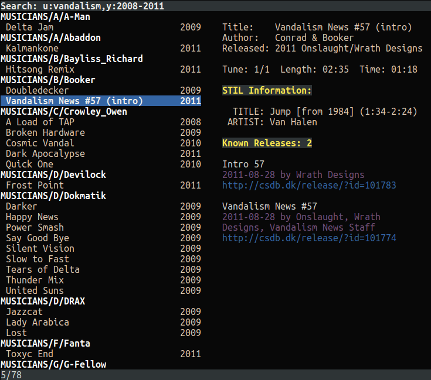

# sidpicker
Terminal interface for browsing/searching [HVSC](http://www.hvsc.c64.org/) and playing SID tunes.



## Requirements

- High Voltage SID Collection (download [here](http://www.hvsc.c64.org/#download))
- sidplayfp  (download [here](https://sourceforge.net/projects/sidplay-residfp/files/sidplayfp/1.4/))
- C-64 ROM dumps (basic, kernal and chargen) (download [here](https://sourceforge.net/p/vice-emu/code/HEAD/tree/trunk/vice/data/C64/))

## Setup

### HVSC

The `HVSC_BASE` environment variable must be set to point to the base directory of your extracted HVSC installation.

Examples:

Linux or MacOS:
```
export HVSC_BASE=~/Download/C64Music
```
Windows:
```
setx HVSC_BASE C:\Download\C64Music
```

If you have HVSC release version 66, you can copy the file `tunes-hvsc66.json.gz` into
the `HVSC_BASE` directory and rename it to `tunes.json.gz`.

If you have a different version of HVSC, sidpicker will build the tunes.json.gz itself
the first time you run it, but it will take a while.

### sidplayfp

The sidplayfp configuration file needs to be edited to point to the C-64 ROM dumps, since many
SID tunes contain code that rely on these to run properly.

On Linux or MacOS, edit the file `~/.config/sidplayfp/sidplayfp.ini`:
```
Kernal Rom = /usr/local/lib64/vice/C64/kernal
Basic Rom = /usr/local/lib64/vice/C64/basic
Chargen Rom = /usr/local/lib64/vice/C64/chargen
```

On Windows, edit the file `%appdata%\sidplayfp\sidplayfp.ini`:
```
Kernal Rom = C:\C64\vice\C64\kernal
Basic Rom = C:\C64\vice\C64\basic
Chargen Rom = C:\C64\vice\C64\chargen
```

## Usage

Simply run `sidpicker` in your terminal to start. At startup it will read the tune index and present you with a list of all tunes in the HVSC.

### Keyboard input

   - `arrow down` - move down one position in the list
   - `arrow up` - move up one position in the list
   - `page down` - scroll the list one page down
   - `page up` - scroll the list one page up
   - `enter` - play the currently selected entry in the list
   - `space` - play the next entry in the list
   - `escape` - if a tune is playing, stop playing. otherwise, exit sidpicker
   - `/` - Edit search query (use cursor keys and backspace, `enter` when done)
   - `1-9` - Play specific subtune
   - `arrow right` - Play next subtune
   - `arrow left` - Play previous subtune

### Search query

There are two types of search queries: simple and advanced. In both cases, all string matching is case insensitive.

#### Simple search

The simple type is just a substring search through tune's text fields.

Type `/`, enter a phrase then type `Enter`. The list will now be filtered to include tunes where
the phrase you entered is included in either the title, author, released or STIL info fields.

#### Advanced search

The advanced type uses a prefix notation to allow filtering on specific fields and related data:

  - `a:string` - Author field must include the given string
  - `n:string` - Title field must include the given string (t:string also works)
  - `c:string` - Released field must include the given string
  - `p:string` - The path within HVSC must include the given string
  - `s:string` - STIL information must include the given string
  - `u:string` - CSDb "releases used" must include the given string
  - `y:range`  - Release year of the tune must be contained in or overlap the given year range
  
Year ranges can be a single year, an open interval or a closed interval. Years can be entered with 4 or 2 digits. When 2 digits is used, 70 or above is interpreted as 19xx while a number below 70 is interpreted as 20xx.

Some examples:

  - `1991`  - Include tunes released in 1991
  - `89`    - Include tunes released in 1989
  - `-1992` - Include tunes released in 1992 or earlier
  - `08-` - Include tunes released in 2008 or later
  - `95-04` - Include tunes released between 1995 and 2004

To filter on multiple terms, separate them by a comma:

  - `p:prosonix,y:2010-` - Include tunes with `prosonix` in the path released in 2010 or later
  - `n:intro,u:genesis project` - Include tunes with `intro` in the title, used in a Genesis Project release
